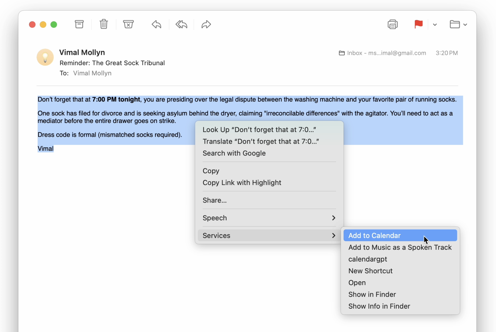

# Right Click → Add to Calendar

Select any text, right-click, and add it to your Apple Calendar. Uses Gemini Flash to parse event details automatically. Made with Claude Code when I was bored in class.



## Setup

1. Get a [Gemini API key](https://aistudio.google.com/apikey) (free)

2. Clone and add your key:
   ```
   git clone https://github.com/paan/RightClickAddToCalendar.git
   cd RightClickAddToCalendar
   cp RightClickAddToCalendar/.env.example RightClickAddToCalendar/.env
   ```
   Edit `RightClickAddToCalendar/.env` and paste your API key.

3. Build and install:
   ```
   xcodebuild -scheme RightClickAddToCalendar -configuration Release build
   ```
   Or open `RightClickAddToCalendar.xcodeproj` in Xcode and hit Run.

4. Copy the built app to Applications:
   ```
   cp -R ~/Library/Developer/Xcode/DerivedData/RightClickAddToCalendar-*/Build/Products/Release/RightClickAddToCalendar.app /Applications/
   ```

5. Open the app. It runs in the background (no dock icon). To start it automatically on login, add it in **System Settings → General → Login Items**.

6. Select any text → right-click → **Services** → **Add to Calendar**.

> If the service doesn't appear, go to **System Settings → Keyboard → Keyboard Shortcuts → Services** and enable "Add to Calendar". You may need to log out and back in.
